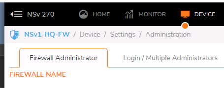
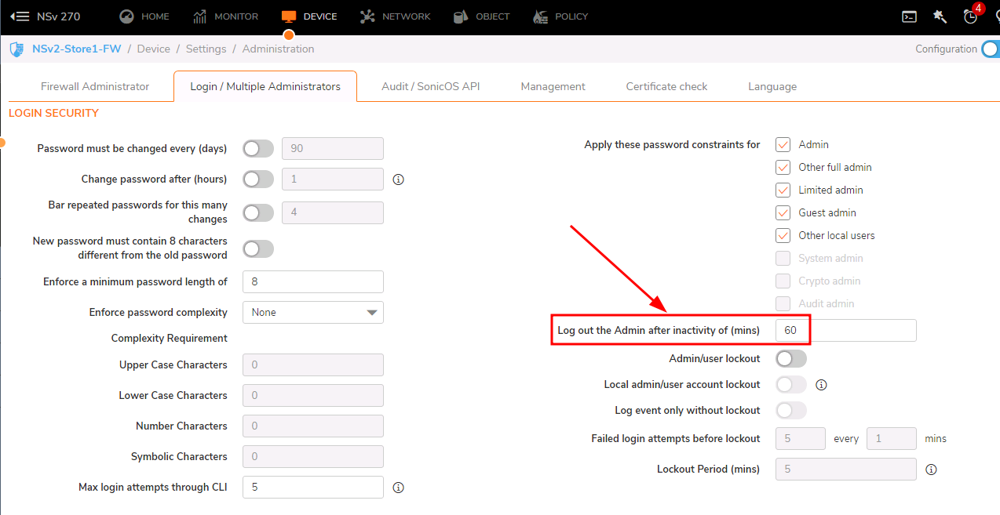

## Registering a device:
1. Logged into firewall
2. Clicked on "Register Device" on home page
3. Input the given credentials, serial, and auth keys
4. Waited for system to reboot

## Changing a firewall's name
1. Go to device > Settings > Administration
2. Change firewall name
3. Click save
4. Refresh the Window and the new name will be in the upper left corner 
## Update logout timer
1. Go to Device > Settings > Administration > Login/Multiple Administrators
2. Update Log out the Admin after inactivity of (mins) from the default of 5 minutes to 60 minutes 
3. Click Accept at the bottom of the screen

### Registration Takeaways

- Registering a SonicWall firewall is required in order to gain access to paid license content such as Content filtering, Gateway Anti-Virus, Intrusion Prevention, etc.
- Before you register your SonicWall product, you will need the serial number and authentication code

## Creating Zones
1. Log into firewall
2. Go to Objects > Match Objects > Zones
3. Select Add Zone button  
4. Enter zone name
5. Choose security type 
6. Click Save after choosing General settings

### Zone Takeaways

- Security Type defines the level of trust given to a zone
- The SonicWall NSV firewall offers three types of zone security: Trusted, Public, and SSL VPN
- Trusted is a security type that provides the highest level of trust
- Public security type offers a lower level of trust than a Trusted zone
- SSL VPN is used for secure remote access, using the SonicWall NetExtender client
## Creating Sub-Interfaces

1. Go to Network > System > Interfaces
2. Click "Add Interface"
3. Choose the zone to be associated with the interface
4. Set the VLAN Tag
5. Choose the Parent Interface
6. Set an IP address for the interface and verify the subnet mask
7. At the bottom choose Management options

### Interface Takeaways

- Physical interfaces are bound to a single port
- Virtual interfaces are assigned as sub-interfaces to a physical interface
- Virtual interfaces allow the physical interface to carry traffic assigned to multiple interfaces
- Virtual interfaces provide many of the same features as physical interfaces, including zone
- assignment, DHCP Server, and NAT and Access Rule controls

## Creating Host Address Objects

1. Go to Object > Match Objects > Addresses to pull up the Address Objects menu
2. Click "Add" 
3. Specify the name, the Zone, the object type, and IP address 
4. Click Save
5. Change view to Custom to see user defined objects

### Note on Default Zones

### Note on Object Types

### Address Object Takeaways
## Creating Service Objects

1. Go to Object > Match Objects > Services to access the Service Objects menu
2. Click "Add" 
3. Specify the name, protocol, and Port Range if you are creating a TCP/UDP object. For a TCP/UDP object a sub type does not need to be specified 
4. Click Save, then close
5. Change view to Custom to see user defined objects 
### Service Object Takeaways
## Creating NAT Rules

## Creating Access Rules

Go to Policy > Rules and Policies > Access Rules
Set Zone Policy Matrix to WAN > Ecommerce
Clicked add in low left corner
Set name and source/destination settings and clicked add
from another server tested by going to specified IP and port

### Access Rule Takeaways
Outside in is denied by default
inside out is allowed by default

## Bandwidth Management
Classifier: 
Bandwidth Rule

### Adding an object
Go to Objects > Profile Objects > Bandwidth
Click Add
Specify the name, the guaranteed and maximum bandwidth
Click save

### Apply the object to a firewall rule

### Bandwidth management on an interface

## Basic Threat Protection

### Intrusion Prevention
Best practice: 
Prevent all for high and medium priority
Detect all for high, medium, and low priority attacks
leave log redundancy as 0,0,60

## Advanced Threat Protection

## Site-To-Site VPN

Anything that traverses the VPN needs to be in the VPN zone
Enable keep alive on site with least overhead
